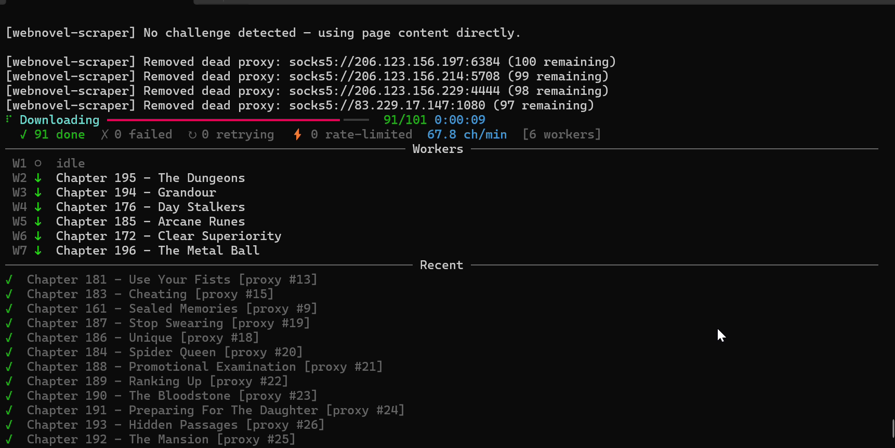

# webnovel-scraper

Professional modular webnovel scraper and EPUB generator. Uses playwright stealth as a last resort to pass challenges.

## Requirements

- Python 3.13+
- [uv](https://docs.astral.sh/uv/)

## Installation

```bash
uv sync
uv run playwright install chromium
```

## How to run

All commands are run via `uv run webnovel-scraper`.

### Interactive mode (recommended)

Launch a full interactive session — search, pick a result, configure a chapter range,
and download, all from a single prompt-driven UI:

```bash
uv run webnovel-scraper
```

The interactive UI includes a **Settings** menu where you can adjust all runtime
parameters without restarting (workers, rate factors, delays, etc.).

Fuzzy Search lets you quickly find a novel by title, even with typos or partial input.


### Search

Search for a novel title and see fuzzy-matched candidates:

```bash
uv run webnovel-scraper search "shadow slave"
```

### Download

Download a novel and generate an EPUB in the `output/` directory:

```bash
uv run webnovel-scraper download https://novellive.app/book/shadow-slave
```
Downloading a chapter via interactive mode:



Options:

```
--output PATH     Output directory for the generated EPUB (default: output/)
--yes, -y         Skip the chapter-list confirmation prompt
--start N         First chapter to download (1-based, inclusive)
--end N           Last chapter to download (1-based, inclusive)
```

### Debug

Inspect how a URL is resolved — scraper, HTTP status, chapter count, pagination:

```bash
uv run webnovel-scraper debug https://novellive.app/book/shadow-slave
```

Add `--raw` to also print the first 800 characters of raw HTML.

### Global flags

These flags apply to every subcommand and go **before** the subcommand name:

```
--page-delay SECS         Wait time after Playwright page load in seconds (default: 1.0)
--workers N               Concurrent chapter-download workers (default: 8)
--max-browser-sessions N  Max simultaneous headed browser windows for bot challenges (default: 3)
```

Example — download a chapter range with more workers and no confirmation prompt:

```bash
uv run webnovel-scraper --workers 12 download -y --start 1 --end 100 https://novellive.app/book/shadow-slave
```

## Proxy support

Proxies are loaded from files inside the `proxies/` directory at the project root.
Paste one proxy per line (bare `host:port` or full URL — the scheme is added automatically).
Lines starting with `#` are treated as comments.

| File | Protocol |
|------|----------|
| `proxies/proxies_http.txt` | HTTP (`http://`) |
| `proxies/proxies_socks4.txt` | SOCKS4 (`socks4://`) |
| `proxies/proxies_socks5.txt` | SOCKS5 (`socks5://`) |

**Warm-up:** at startup all proxies are probed in parallel (8 s timeout). Dead ones are
removed from the pool before any scraping begins.

**Rotation:** proxies are used in round-robin order. Any proxy that produces a transport
error during scraping (timeout, connect failure, bad response header, SSL error, etc.) is
blacklisted on the spot and never reused.

**Rate behaviour with proxies:** when proxies are loaded the starting request interval is
set to 0.2 s (5 req/s) instead of reading from the saved rate cache, and the default
worker count is 8. Each successful chapter download shows the proxy number that delivered
it in the progress log.

## Adaptive rate control

The scraper uses an AIMD (Additive Increase / Multiplicative Decrease) rate controller
per domain, similar to TCP congestion control:

- **Throttle** (429 / bot challenge): interval `×= backoff_factor` (default `1.5`)
- **Success streak** (≥ 5 in a row): interval `×= recovery_factor` (default `0.9`) — fast
  multiplicative climb back to full speed
- **First few successes**: flat additive step of 0.01 s — cautious probing

Both factors are tunable via the interactive **Settings** menu or at startup. Lower
`backoff_factor` (e.g. `1.2`) means gentler slowdowns; lower `recovery_factor` (e.g. `0.7`)
means much faster speedup after a throttle clears.

Rate state is persisted to `~/.cache/webnovel-scraper/rates.json` between runs.

## Development

### Setup pre-commit

```bash
uv run pre-commit install
```

### Lint / format / type-check

```bash
uv run ruff check app/
uv run ruff format app/
uv run ty check app/
```
